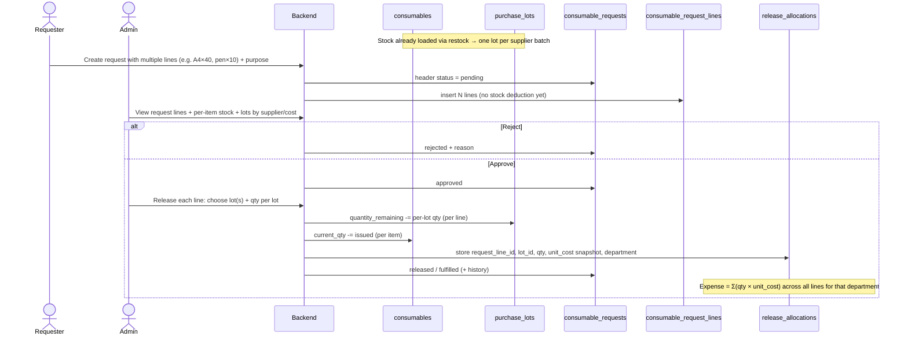

# Asset Classifications & Request Flows

> **Purpose:** Confirm the target domain model for **borrowable**, **assignable**, and **consumable** inventory before backend implementation continues (backend-only first; no UI integration in this phase).  
> **Source of truth for schema context:** live `db.sql` + Drizzle schemas under `src/server/db/`.  
> **Status:** Design intent + how it maps to what already exists.

---

## 1. Three classifications (what they mean)

| Classification | Kind of thing | Custody model | Returned? | Cost / lot tracking |
|----------------|---------------|---------------|-----------|---------------------|
| **Borrowable** | Coded capital unit (unique `asset_code` / QR) | Short-term departmental borrow | **Yes** — expected return date | Optional via `purchase_lots` on acquisition; custody via `borrow_transactions` |
| **Assignable** | Same coded capital unit, different custody path | Long-term custody (projects) | **Yes** when project ends / unassigns — not a short borrow | Project assignment records; acquisition cost still on lots if restocked as asset |
| **Consumable** | Bulk product by **quantity + unit** (not one QR per piece) | Issued / consumed | **No** | **Required for accurate release:** supplier **purchase lots** with remaining qty + unit cost |

### Mental model (consumables vs assets)

```
Category (taxonomy)          e.g. Bond Paper
  └── Consumable item        e.g. A4 Bond Paper   → consumables row
        └── Purchase lots    LOT-… from Supplier A (qty remaining, ₱/unit)
        └── Purchase lots    LOT-… from Supplier B (qty remaining, different ₱)
        └── overall current_qty = sum of lot quantity_remaining (+ any uncosted stock)

Coded asset tree (parallel, not the same table):
Category
  └── Asset model (optional catalog)   e.g. Epson 310 Printer
        └── Physical units             each has unique asset_code + assignment_type
```

**Strict rule you asked for (consumables):**  
Requester asks for the **product** (A4 bond paper × N).  
Admin, on release, chooses **which lot(s)** to pull from so department expense uses the **correct unit cost / supplier**, and stock is deducted from **that lot’s `quantity_remaining`**, not a vague global number only.

---

## 2. What the current backend already supports (reality check)

| Area | Present today | Gap vs target request flow |
|------|---------------|----------------------------|
| Assets `assignment_type` `borrowable` \| `assignable` | Yes | — |
| Borrow request → approve/reject → release → return (coded assets) | Yes (`borrow_requests`, `borrow_transactions`) | Asset-only; `expected_return_date` is part of the model |
| Assignable → project assign/return | Yes (`project_asset_assignments`) | Not mixed with short-term borrow |
| Consumable CRUD + restock (creates lot) | Yes | — |
| Checkout (FIFO over lots) | Yes `POST …/checkout` | Admin-initiated; **not** driven by a requester → approve → release pipeline |
| Release from **specific** lot (scan lot code) | Yes `purchase-lots/scan/release` | Same: admin-ad-hoc, not request-linked |
| Manual adjust (+ free-text reason in history) | Yes `POST …/adjust` | Adjust does **not** currently rebalance lots (product decision needed) |
| Consumable **request** table / statuses | **No** first-class module | Draft `docs/DATA_MODEL.md` imagined it; prod schema does not wire `consumable_id` on `borrow_requests` |
| Department expense from released lots | Partial (project expense can FIFO checkout; department rollup from releases not a general request artifact) | Need explicit release lines tied to request + department |

This doc defines the **target flows**. Implementation work starts after this is accepted.

---

## 3. Target inventory hierarchy (consumables)

### Example

| Layer | Example | Table / concept |
|-------|---------|-----------------|
| Category | Bond Paper | `categories` with `type = 'consumable'` |
| Item / product | A4 Bond Paper | `consumables` (`item_code`, name, unit, `current_qty`, `min_threshold`, location) |
| Batch / lot | Restock from Supplier X on 2026-03-01, 500 pcs @ ₱2.10 | `purchase_lots` (`lot_code`, `supplier_id`, `quantity`, `quantity_remaining`, `unit_cost`) |
| Movement history | restock / checkout / adjustment | `consumables.history` (jsonb) + preferably `audit_logs` |
| Accountability | who requested, who approved, who released, from which lots | **Need:** consumable request + release allocation records |

### Rules

1. **Request** is against the **item** (product), never against a supplier/lot.
2. **Release** always names **one or more lots** and quantities per lot (admin-chosen; may allow multi-lot for large N).
3. Deduct:
   - `purchase_lots.quantity_remaining` for each chosen lot
   - `consumables.current_qty` by the total released
4. Snapshot cost at release: `qty × unit_cost` per lot → sum = expense attributable to that department (for that issue).
5. Stock is **not** reduced when the request is filed or when it is only approved — only on **release** (issue).
6. Manual **adjust** (inventory correction) requires free-text reason; see §8 decision **#4** and §8.1 for how adjust interacts with lots.

---

## 4. End-to-end flows

### 4.0 High-level picture (all three)

```mermaid
flowchart TB
  subgraph Requester
    R[Requester dashboard]
  end

  R -->|wants coded equipment short-term| BR[Borrowable request]
  R -->|wants bulk supplies| CR[Consumable request]
  R -.->|usually staff/project ops, not self-serve short form| AR[Assignable path]

  BR --> BA[Admin: approve / reject]
  BA -->|approved| BRel[Admin: release specific asset unit]
  BRel --> BT[Active borrow transaction + due date]
  BT --> BRet[Return + condition]

  CR --> CA[Admin: approve / reject]
  CA -->|approved| CRel[Admin: choose lot(s) + release qty]
  CRel --> CD[Deduct lots + item qty + cost snapshot]
  CD --> CE[Department expense / history]

  AR --> PA[Project: assign assignable asset]
  PA --> PR[Later: return from project]
```

---

### 4.1 Borrowable flow (coded asset, short-term)

**Actors:** Requester, Admin/staff  
**Entities:** `assets` (`assignment_type = borrowable`), `borrow_requests`, `borrow_transactions`, asset lifecycle / audit

```mermaid
sequenceDiagram
  actor Req as Requester
  actor Adm as Admin
  participant API as Backend
  participant AR as assets
  participant BR as borrow_requests
  participant BT as borrow_transactions

  Req->>API: Create borrow request (asset or description, purpose, expected return)
  API->>BR: status = pending
  Adm->>API: Approve or Reject
  alt Rejected
    API->>BR: status = rejected + reason
  else Approved
    API->>BR: status = approved
    Adm->>API: Release (bind physical asset_code / id, picker notes)
    API->>AR: set current_holder, department
    API->>BT: create active transaction, due_date = expected return
    API->>BR: status = released / history entry
    Note over BT: Asset is out; tracked until return
    Adm->>API: Return (condition, notes)
    API->>AR: clear holder / update status if damaged
    API->>BT: returned_at, condition
  end
```

**Status sketch (request):**  
`pending → approved | rejected → released → returned` (plus cancelled by requester if still pending)

**Guards (as already coded elsewhere):**

- Assignable assets must **not** go through borrow checkout.
- One active custodial borrow per asset (no double-release).

**Return:** Expected. Overdue can be derived from `due_date` vs now.

---

### 4.2 Assignable flow (coded asset, long-term / project)

**Actors:** Admin (primarily); project context  
**Entities:** `assets` (`assignment_type = assignable`), `projects`, `project_asset_assignments`

```mermaid
sequenceDiagram
  actor Adm as Admin
  participant API as Backend
  participant AR as assets
  participant PA as project_asset_assignments
  participant PJ as projects

  Adm->>API: Assign asset to project
  API->>AR: verify assignment_type = assignable, available
  API->>PA: status = assigned, assigned_by, notes
  API->>AR: current_holder / project custody fields as designed
  Note over PA: Long-term; no short-term expected_return on borrow_requests
  Adm->>API: Return asset from project
  API->>PA: returned_at, return_notes, status = returned
  API->>AR: clear project custody
```

**Not the same queue as short-term borrow requests.**  
Assignable is project custody, not “borrow for a week.”

---

### 4.3 Consumable flow (product + lots — target)

**Actors:** Requester, Admin  
**Entities (target):**

| Entity | Role |
|--------|------|
| `consumables` | Product catalog + rolled-up qty |
| `purchase_lots` | Supplier batches with remaining qty & unit cost |
| **`consumable_requests`** *(dedicated — to build)* | Header: requester, department, purpose, status |
| **`consumable_request_lines`** *(to build)* | One or more products per request (`consumable_id` + qty) |
| **Release allocations** *(to build)* | Per line × per lot qty deducted on issue |
| History / `audit_logs` | Accountability |

#### Happy path (multi-product request)



#### Inventory ops (admin, any time — not request-bound)

| Action | Effect | Logging |
|--------|--------|---------|
| **Create item** | New `consumables` row under a consumable category | audit / history if initial stock |
| **Edit item** | Metadata: name, unit, threshold, location, notes (not “secret” qty without adjust) | audit |
| **Restock / add lot** | +`current_qty`, new `purchase_lots` row (supplier, qty, unit_cost, date, reference) | history `restock` + lot code |
| **Release from specific lot** | −lot, −item qty (request-linked preferred) | history `checkout` + lot allocations |
| **FIFO checkout** | Auto-allocate oldest lots when admin does not pick (optional secondary path) | same |
| **Manual adjust** | ± qty with free-text **reason**; must target lot(s) (decrease) or attach/create correction lot (increase) so item total and lot remainders stay in sync | history `adjustment` |
| **List lots for item** | See remaining per supplier/batch | read API |

#### Request statuses (proposed)

```
pending → approved → released (issued)
       ↘ rejected
       ↘ cancelled (requester, while pending)
```

Optional later: `partially_released` if multi-step issue is needed.

---

### 4.4 Side-by-side comparison

| Step | Borrowable | Assignable | Consumable |
|------|------------|------------|------------|
| Who initiates | Requester | Admin / project ops | Requester |
| What is reserved | Usually specific unit (or free-text item then bind on release) | Specific unit + project | One or more product lines × quantity |
| Approval | Admin | Direct assign (or workflow if you add one) | Admin |
| “Release” means | Hand over physical unit; holder set | Assign to project | Issue N pieces from chosen lot(s) |
| Inventory impact | Availability via holder, not qty | Same | **Qty + lot remaining** |
| Return | Required by due date | Unassign when done | No return |
| Cost of use | Asset depreciation / value (optional) | Same | **Lot unit costs → department expense** |
| Supplier relevance on issue | Low (unit already bought) | Low | **High — choose batch** |

---

## 5. Accountability (must always leave a trail)

Every meaningful state change should answer:

| Question | Capture |
|----------|---------|
| Who asked? | requester user + name/email/dept |
| What product / asset? | ids + codes + display names |
| How many? | quantity (consumables); 1 unit (coded assets) |
| Who decided? | approve / reject actor + timestamp + reason if reject |
| Who issued / assigned? | release actor + timestamp |
| From where (consumables)? | lot_code(s), supplier, qty per lot, unit_cost, line total |
| Why? | purpose, notes, adjust reason |
| Who returned? | return actor, condition (assets only) |

**Surfaces:** entity history (jsonb where already used), `audit_logs`, and for consumable issues preferably **normalized release lines** so expense reports do not depend only on JSON history.

---

## 6. Target backend capabilities (checklist — consumables first)

When we implement the consumable module “fully” under this design, the backend should cover:

### Catalog & stock

- [x] List / get / create / update consumable items  
- [x] Restock → create purchase lot + increase qty  
- [x] Adjust stock with reason  
- [x] Checkout FIFO / scan release by lot  
- [x] List lots for a consumable (including remaining by supplier) as first-class request-release UX  
- [x] Adjust API: lot-targeted decrease / correction-lot or attach-lot increase (§8.1 — locked)  

### Request lifecycle (priority gap)

- [x] Dedicated tables: `consumable_requests` + `consumable_request_lines` (+ release allocations)  
- [x] Requester: create multi-line request (1..N products × qty + purpose)  
- [x] Requester: list own requests / cancel pending  
- [x] Admin: queue list (pending / approved / released / rejected)  
- [x] Admin: approve / reject (whole request)  
- [x] Admin: release with **explicit lot selection per line** (one or many lots per product)  
- [x] Atomic transaction: lots + item qty + request status + cost snapshot + audit  
- [x] Prevent over-issue (lot remaining & item qty & approved line qty)  

### Reporting hooks

- [ ] Department expense from release allocations (sum of frozen line costs)  
- [ ] Per-item / per-supplier usage report  

### Documentation

- [x] OpenAPI annotations for consumable request lifecycle endpoints  
- [ ] Keep this flow doc updated if statuses change  

---

## 11. Consumable request API (implemented)

| Method | Path | Who |
|--------|------|-----|
| GET | `/api/consumable-requests` | Actor (borrowers see own) |
| POST | `/api/consumable-requests` | Actor |
| GET | `/api/consumable-requests/:id` | Actor (own or operator) |
| POST | `/api/consumable-requests/:id/approve` | Asset operator |
| POST | `/api/consumable-requests/:id/reject` | Asset operator |
| POST | `/api/consumable-requests/:id/cancel` | Requester or operator |
| POST | `/api/consumable-requests/:id/release` | Asset operator (lot allocations or FIFO per line) |

Migration: `0015_consumable_requests.sql`

---

## 12. Borrowable & assignable asset APIs (implemented)

### Borrowable (short-term borrow queue)

| Method | Path | Who |
|--------|------|-----|
| GET/POST | `/api/borrow-requests` | Actor |
| GET | `/api/borrow-requests/:id` | Actor (own or operator) |
| POST | `/api/borrow-requests/:id/approve` | Asset operator |
| POST | `/api/borrow-requests/:id/reject` | Asset operator |
| POST | `/api/borrow-requests/:id/cancel` | Requester or operator (pending only) |
| POST | `/api/borrow-requests/:id/release` | Asset operator — **due date = request `expectedReturnDate`** |
| POST | `/api/borrow-requests/:id/unrelease` | Asset operator (approved, pickup failed) |
| POST | `/api/borrow-requests/:id/return` | Asset operator |
| GET/POST | `/api/borrow-log` | Operator — direct release / list (incl. `?status=overdue`) |
| GET | `/api/borrow-log/:id` | Operator |
| POST | `/api/borrow-log/:id/return` | Operator |
| GET/POST/PATCH/DELETE | `/api/assets`, `/api/assets/:id` | Registry CRUD |
| POST | `/api/assets/:id/release`, `/api/assets/:id/return` | Operator — ad-hoc custody |
| POST | `/api/assets/scan/resolve`, `…/release`, `…/return` | QR scan paths |

Migration: `0016_borrow_request_cancelled.sql` (adds `cancelled` status)

### Assignable (project custody)

| Method | Path | Who |
|--------|------|-----|
| GET/POST | `/api/projects/:id/assets` | Operator — list / assign |
| POST | `/api/projects/:id/assets/:assignmentId/return` | Operator |
| POST | `/api/projects/:id/assets/:assignmentId/damage` | Operator — maintenance or write-off |

Assign/return writes **lifecycle events + audit_logs** (`entityType: project_asset_assignment`).

---


## 7. Mapping example: “40 sheets of A4 from two suppliers”

1. Catalog: category **Bond Paper** → item **A4 Bond Paper** (`CON-…`, unit `pcs`).  
2. Restock 200 from **Supplier A** @ ₱2.00 → LOT-A remaining 200.  
3. Restock 100 from **Supplier B** @ ₱2.35 → LOT-B remaining 100.  
4. Item `current_qty` = 300.  
5. Dept ICT requests **40 pcs**. Request = pending, stock still 300.  
6. Admin approves.  
7. Admin releases **30 from LOT-A** + **10 from LOT-B** (or 40 from one lot).  
8. LOT-A remaining 170; LOT-B remaining 90; item qty 260.  
9. ICT expense for this issue = `30×2.00 + 10×2.35`.  
10. History + audit + release lines record who approved/released and lot breakdown.

---

## 8. Product decisions

| # | Question | Decision |
|---|----------|----------|
| 1 | Can one release span **multiple lots**? | **Yes** — admin allocates until line qty is met |
| 2 | Can approved qty be **partially** released over multiple sessions? | Start with **full release only** (one shot matching all approved line qtys); add partial later if needed |
| 3 | Multi-line requests (several products in one request)? | **Yes — locked.** One request header, many `consumable_request_lines` |
| 4 | Does **manual adjust** update lot remainders? | **Locked — yes.** Decrease: pick lot(s). Increase without purchase: attach to a lot or create a correction lot. Never change item total alone (§8.1) |
| 5 | FIFO fallback when admin does not pick lots? | Optional **FIFO button** for speed; primary UX = pick lot |
| 6 | Who may request consumables? | Authenticated non-viewer staff/borrowers with department; same role model as borrow requests |
| 7 | Reuse `borrow_requests` vs new tables? | **Dedicated** — `consumable_requests` + `consumable_request_lines` + release allocations (**locked**) |
| 8 | Department expense storage | **Release lines** always; optional auto-post to `project_expense_lines` only when tied to a project |

### 8.1 What “adjust vs lots” means (plain language)

You track stock in **two places** that must stay consistent:

1. **Item total** — `consumables.current_qty` (e.g. “A4 Bond Paper: 300 pcs”)
2. **Per-lot remainders** — each supplier batch’s `purchase_lots.quantity_remaining` (e.g. Supplier A: 200, Supplier B: 100 → still 300)

**“Don’t silently desync lots”** means: if an admin does a manual adjust that only changes the item total (e.g. “found 10 missing → set total to 290”) but **does not** reduce any lot’s remaining qty, then:

- Item says **290**
- Lots still add up to **300**
- Later releases / cost reports become wrong (you can “issue” stock that the total said was gone, or costs won’t match reality)

**Recommended rule for implementation:**

| Adjust direction | Behavior |
|------------------|----------|
| **Decrease** (damage, count short, spoilage) | Admin must pick **which lot(s)** lose qty (same as release), plus free-text reason |
| **Increase** without a purchase (found stock, correction) | Either attach to an existing lot, or create a small **adjustment lot** (optional supplier / ₱0 or unknown cost), plus reason — never bump `current_qty` alone |

Restock (real purchase) already creates a proper costed lot — that path stays as-is.

---

## 9. Confirmation summary (understanding check)

| Your point | How it is captured |
|------------|--------------------|
| 3 classifications: borrowable, assignable, consumable | §1 table + §4 flows |
| Borrowable = short-term + return date | §4.1 |
| Assignable = long-term / project custody | §4.2 |
| Consumable = consumed, no return | §4.3 |
| Category → product → **supplier lots** for stock & price | §3 |
| Requester asks for product qty; admin picks lot on release | §4.3 sequence |
| **Multi-product** per request | §4.3 + decision #3 |
| **Dedicated** consumable request tables | decision #7 |
| Inventory deducts from **specific lot** | Rules §3 + example §7 |
| Expenses / prices differ by batch released | Cost snapshot on allocations |
| Manual adjust + free-text reason; lots stay in sync | §8.1 |
| Edit item / add lot / add item | Catalog & stock checklist |
| Accountability logs | §5 |
| Backend first, no integration yet; consumables first | §2 gap + §6 checklist |

**Largest intentional change vs today:** introduce a proper **consumable request → approve → lot-aware release** lifecycle. Stock/lot machinery for FIFO and specific-lot release already exists and should be **reused**, not reinvented.

---

## 10. Next implementation order (proposed)

1. Flow decisions locked (multi-line, dedicated tables, lot-synced adjust).  
2. Design schema deltas: `consumable_requests`, `consumable_request_lines`, release allocation lines.  
3. Implement / document consumable + lot + request APIs (backend only).  
4. Endpoint audit & OpenAPI completeness for consumables.  
5. Later: endpoint audit for borrowable/assignable; then frontend integration for `/consumables` and requester dashboard.

---

*Document generated to align product intent with existing schema before coding the consumable request pathway.*
