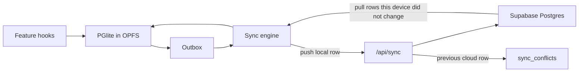

# Offline-first architecture

Each signed-in workstation keeps a full working copy in the browser. The UI reads and writes that copy only. Supabase Postgres stays the shared hub: other workstations pull from it, and it is the durable copy if a machine is lost. It is not the database the screen waits on.

When the same row changed locally and in the cloud since the last sync, the workstation version is pushed and the cloud version is appended to `sync_conflicts`. The last workstation to sync that row wins. The overwritten cloud payload stays in the log.

Stock releases are not row conflicts. Two offline releases are two commands, and both apply, in time order. Overwriting a balance column would drop one release.

## Why this shape

Today the browser never touches Postgres. `src/features/shared/fetch-json.ts` calls the route handlers, which go controller, then service, then repository, then Drizzle in `src/server/db/index.ts`. Auth, realtime, and receipt files are separate Supabase calls. There is no local database. `src/app/(private)/layout.tsx` redirects to sign-in when claims fail, and throws if profile lookup cannot reach Postgres. `src/components/providers/query-provider.tsx` only refetches after reconnect. It does not queue writes.

A per-browser copy has to be Postgres-shaped. The schema is the tables under `src/server/db/schema/` (enums, uuids, jsonb). **PGlite** (Postgres compiled to WASM, persisted in OPFS) avoids translating that schema to SQLite. Drizzle stays on the server. The browser uses a thin typed query layer over PGlite, generated from the same table list, not a second ORM.

Sync still enters through services so tenant scope, roles, and `departmentId` XOR `projectId` stay enforced on the hub. The client applies the same command locally so the screen updates before the network returns.

## Sync rules

- Every synced table has `updated_at` and `updated_by_device_id`. A `device_id` is created once per browser and stored in the local database.
- **Push.** Outbox entries go to `POST /api/sync/push` in order. The server compares the incoming row to the hub row. If the hub row changed after this device's last cursor and the payload differs, insert the hub row into `sync_conflicts`, then upsert the workstation row.
- **Pull.** `GET /api/sync/pull?cursor=` returns hub rows changed since the cursor. Apply a pulled row only when this device has no unpushed edit for that primary key. Dirty local rows are left alone until their push lands.
- **Realtime** (`src/hooks/use-borrower-realtime-sync.ts`, voucher and petty-cash hooks) becomes a signal to pull, not a second cache.
- **Stock.** `release` and receipt commands are append-only. The server replays them in `updated_at` order through the existing release service (FIFO lots, deduct only at release). Balances are derived. A command that cannot be applied is stored on the conflict log with the command payload and is not silently dropped.
- **Deletes** are soft-deletes (`deleted_at`) so a later sync cannot resurrect a row by missing the delete.
- One tab is the sync leader (BroadcastChannel) so two tabs do not push the same outbox twice.

## Auth and the app shell

Sign-in still needs the network once. After that, the server writes a profile snapshot (user id, role, tenant, active flag) into an httpOnly cookie and the client copies it into PGlite.

Offline, Supabase token refresh will fail and the private layout will redirect. A service worker (Serwist) precaches the signed-in app shell and serves it when navigation fails. A client gate reads the cached profile and allows work for a bounded window (7 days since the last successful online session). Expired or deactivated profiles still cannot act. The outbox stays queued until the next online sign-in, then pushes under that user.

New account creation and password reset stay online-only.

## Files and receipts

Receipt images are written to OPFS first and uploaded through the existing receipt route when the sync leader is online. The local row stores a blob key until the receipt URL is filled from Supabase Storage. Cloud storage remains the shared copy other devices pull.

## Rollout

Do not sync every table in one change. One write path: local database, then sync. Online mode uses that same path so there is not a second live-API implementation to drift.

1. **Foundation.** PGlite opener, device id, outbox, cursors, `sync_conflicts` migration, `updated_at` / `updated_by_device_id` where missing, Serwist shell, offline profile gate. No feature UI yet.
2. **First documents.** Petty cash and disbursement vouchers. They are document edits with an audit log, which matches local-wins plus a conflict log. Hooks in `src/features/petty-cash/client/` and `src/features/vouchers/client/` read PGlite. Mutations write the local row and the outbox.
3. **Borrow requests.** Same row sync. Realtime provider only triggers pull.
4. **Inventory and purchase lots.** Switch stock-moving actions to the command log. Keep FIFO inside the existing release service on the hub, and mirror the resulting lots into PGlite on pull.
5. **Receipts and the remaining catalogs** (departments, assets, maintenance, projects). Catalog rows use the same local-wins rule.
6. **Remove the offline toast** that says actions are unavailable, once step 2 can create and edit a voucher with the network disabled and then sync it.

Server modules keep controller, service, repository. New code is `src/client/local-db/` (PGlite, schema subset, outbox) and `src/client/sync/` (leader, push, pull). New routes: `src/app/api/sync/push/route.ts` and `src/app/api/sync/pull/route.ts`. Conflict review is a read-only list on top of `sync_conflicts` for admins. Restoring a logged cloud row is a later, explicit action, not the default.

## Limits

- Two people offline can edit one voucher. Whoever syncs last replaces the hub row. The other version is in `sync_conflicts`, not merged field-by-field.
- A workstation that never comes back keeps its edits only on that machine. The hub cannot see them.
- The first load on a new browser needs the network to sign in and pull the tenant snapshot.
- Cloudflare Workers still host the sync API. The worker is not the working database.

## Status

Design only. Not implemented.
